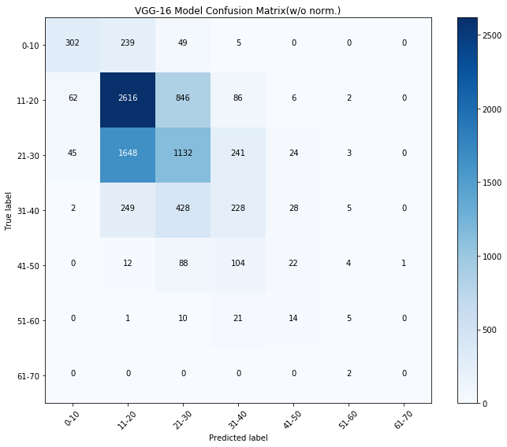
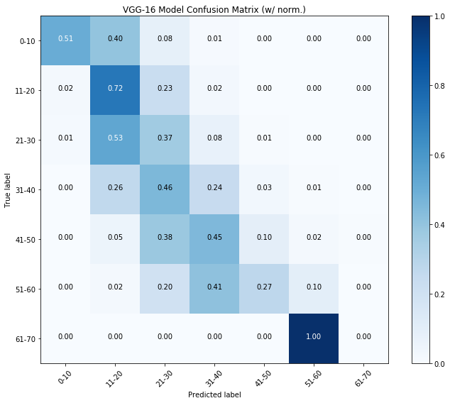

# Capstone - Age Estimation using Convolutional Neural Networks
  
[Roy Kim](www.roykim.me)

## Executive Summary
The problem statement and goal for this project is as follows: Using convolutional neural networks, I will train a classification model to predict someone’s age group based upon his/her picture. Model performance will be guided by cross entropy and accuracy (as well as considering the confusion matrix and other metrics), and the model will aim to achieve a score greater than baseline accuracy (determined by the number of classes).

The data was retrieved from two sources, the [MegaAge and MegaAge Asian](http://mmlab.ie.cuhk.edu.hk/projects/MegaAge/) datasets. These images come preprocessed, meaning that the face was already extracted from each image, and the size of each face image was standardized to be 178x218 pixels.

The metrics that were used in this project were cross entropy (mainly as a loss function for the convolutional neural network) and accuracy. However, in this case of multiclass prediction where classes were not completely independent of each other (ie. the age group of `21-30` should exhibit more common characteristics with the age group of `31-40` than the age group of `71-80`), the confusion matrix was also considered.

There were a few models that were trained on the dataset. The first was a model that was trained from scratch on local hardware. This model achieved an accuracy score of about 29%, meaning that it correctly classified the age group of the person in the picture only 29% of the time.

The second model used a pre-trained model (the [VGG-16 Face model](https://github.com/rcmalli/keras-vggface)) to help with classification. The VGG-16 Convolutional Neural Network has 138 million parameters, as opposed to the simpler model created earlier. Using this model, the age estimations achieved an accuracy score of about 64% on the train data and 51% on the test data. There is some overfitting at this point, and using some regularization techniques in the future, as well as allowing for more training time, would help alleviate this issue.

## Statistical Analysis
One of the greatest hurdles in the project is class imbalance. For further iterations, undersampling the higher percentage classes might be necessary to see improvement in accuracy. 

MegaAge Train Dataset |  MegaAge Test Dataset
:--------------------:|:--------------------:
|  

The class imbalance for the train and test images from the MegaAge dataset can be seen here.

MegaAge Asian Train Dataset |  MegaAge Asian Test Dataset
:--------------------:|:--------------------:
|  

The class imbalance for the train and test images from the MegaAge Asian dataset can be seen. This dataset is somewhat more balanced than the MegaAge dataset, but still has a high imbalance.

Combined Train Dataset |  Combined Test Dataset
:--------------------:|:--------------------:
 |   

Combined together, there is still high class imbalance, especially in the test dataset. Based on the imbalance, we can expect the base accuracy of any model would be to guess the majority class. In this case, the majority class for the train dataset is `21-30` age group and choosing that majority class to predict on the test dataset would yield an accuracy score of 36.3%. This number will serve as the baseline going forward.

After modeling, the VGG-16 model achieved an accuracy score of about 50.5% on the test data. The predictions from the VGG-16 model were recorded to further analyze the model (beyond simple accuracy). The following confusion matrix shows how the VGG-16 model is predicting versus the true classes of the images. 

VGG-16 Model Confusion Matrix |  Normalized
:--------------------:|:--------------------:
 | 

In the evaluation of the model, one thing that was considered was a "One-Off" metric. This metric took into account that the age group classifications are not wholly independent of one another, and that the class `0-10` is closer to `11-20` than `51-60`. With that in mind, I created a simple function to calculate this metric:

```python
def one_off(y_test, y_pred):
    map_class = {
        '0-10': 0,
        '11-20': 1,
        '21-30': 2,
        '31-40': 3,
        '41-50': 4,
        '51-60': 5,
        '61-70': 6
    }
    
    acc_count = 0
    
    for i in range(len(y_test)):
        if map_class[y_pred[i]] == map_class[y_test[i]]:
            acc_count += 1
        elif map_class[y_pred[i]] == map_class[y_test[i]] - 1 or map_class[y_pred[i]] == map_class[y_test[i]] + 1:
            # Note, 0.5 is somewhat arbitrary, perhaps another value would be better suited?
            acc_count += 0.5
    
    return acc_count/len(y_test)
```
With this metric, the VGG-16 model scored 0.709, which is much higher than its plain accuracy score of 0.505. This shows that the model was learning at something of differentiating age groups. However, the heavy class imbalance is something to be wary of. The "One-Off" metric on the base model (which learned nothing but only guessed the majority class) was 0.629. Quite high, since much of the observations were in classes `11-20` and `21-30`. Yet, there is still evidence that the model is learning to differentiate age group classes.

## Process
- ### Data collection and processing:
Data was collected through the links above and hosted locally. After downloading the MegaAge data, I placed each of the images into a new directory based upon the age group classes they would fall in programmatically. When doing this, I realized that there was high class imbalance. As such, I decided to limit the scope of the dataset and only allow 1500 images per class as a maximum in the train dataset, and 500 images per class as a maximum in the test dataset. Furthermore, I originally had 10 classes, ranging from 0-10, 11-20, ..., 81-90, and >90. However, the downloaded dataset did not have anyone in the 71-80, 81-90, and >90 age groups, so those classes were eliminated (for a total of 7 classes remaining). After looking at the normalized value counts, the baseline accuracy for the model was about 22%.

- ### Creating the first model:
The first model was created from the ground up using Keras on my local machine. After checking that the images were placed correctly in the formatted file structure, the `flow_from_directory` method was used to feed the images into the model. I initially set the number of epochs to 5, feeding in all the train and test images (about 7500 and 2300 respectively). The model scored lower than the baseline, with an accuracy score of about 19%. This model was saved as a `.json` file, with the weights saved in a `.h5` file, as well. In fact, the model was not learning anything, just choosing the majority train class (age group '31-40') for all predictions.

- ### Running the first model on AWS:
After running the model locally, I transferred the model to Amazon Web Services (AWS) using a deep-learning AMI (Amazon Machine Image). The reason for transferring the work from my local machine was two-fold: one, the processing power available on AWS allowed me to analyze more images while incorporating more complex models all in a shorter amount of time. Two, because the modeling was done on the cloud, I didn't have to run it locally on my computer. By running it on the cloud, I was able to include more images in my modeling (both MegaAge and MegaAge Asian datasets with about 73,411 train images and 8,530 test images). Although the model trained at faster times, it was still was unable to learn anything.

- ### Using the pre-trained VGG-16 Faces model:
The second model was created by using the pre-trained VGG-16 Face model
The VGG-16 model is a pre-trained model that has been trained by Oxford University's Visual Geometry Group (VGG) and achieved state-of-the-art performance on image recognition. The VGG-16 Face model is a further pre-trained model that uses the underlying VGG-16 model and is trained on thousands of faces. However, the VGG-16 Face model is quite deep, with 16 convolutional, pooling, and dense layers.  

 

Even running on AWS, the model took quite some time to run through the dataset (about 30 minutes for each **epoch**). I trained my model initially, training it overnight. To my surprise, the model not learning anything. After doing some research, I increased the batch size from 16 to 32. With this tweak, the model started to learn gradually. Why this is the case is outlined in an article linked in the resources section. With that training, the model was able to achieve an accuracy score of 

- ### Extra: Applying the model to a live video feed via OpenCV
Due to time constraints, this section has not been realized. However, going forward, there are a few additional thing that I aim to apply to my trained model:
- use a live video feed via OpenCV to classify someone's age group based on their face (perhaps using a computer's webcam)
- create a regression problem where the model predicts age, as opposed to age group
- implementing a validation training set (instead of only having a train and test split)

## Resources:
- https://arxiv.org/abs/1711.00489v2
